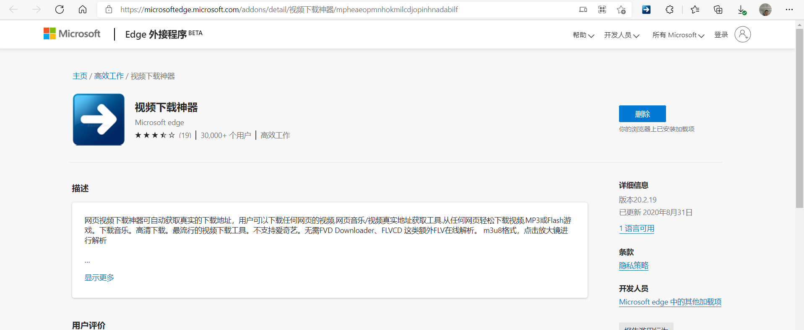
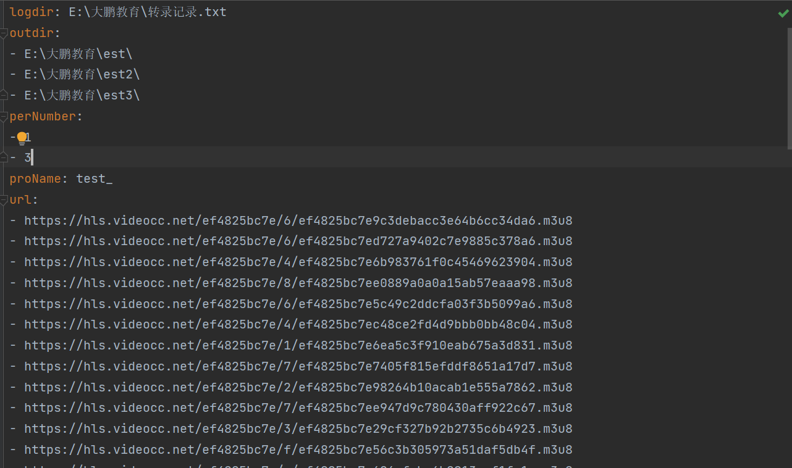
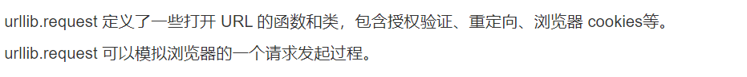

# WebVideoDownload_暂时只支持m3u8
##首先推荐下载一款网页插件
https://microsoftedge.microsoft.com/addons/detail/%E8%A7%86%E9%A2%91%E4%B8%8B%E8%BD%BD%E7%A5%9E%E5%99%A8/mpheaeopmnhokmilcdjopinhnadabilf
####在edge上的一款网页插件

注意：拿edge浏览器打开下载，安装之后就在其右上角
理由：
这款插件可以自动解析当前网页上的视频链接
如果不想安装就F12，去网络中找视频对应的链接，比较麻烦，故推荐
##其次填写配置文件
###url.yaml

#####如上图
下面介绍如何填写
#####logdir 为日志目录：输出格式为 E://XXXX/xxxx.txt记录下载log
#####outdir 为下载文件目录：可以设置为多个目录，每个文件下可以设置存放数量
#####pernumber 为分割参数： 若outdir存在多个，此参数为控制每个目录里存放文件的序号，比如[2,5]表示第一个文件夹下放序号1到2，第二个文件夹下放3到5，其余都放到最后一个中
#####preName 为视频前缀 
#####url 为用之前视频解析工具解析出来的链接
填写完之后：
直接运行main.py  即可
注意：要存放的目录下必须是空的 
#m4s

现在网址似乎都会分析其请求地址，所以好像你不从它们的网站请求链接，就会被墙，返回403
解决办法是使用urllib.request模拟网站发出请求
现在对b站进行测试
https://r3---sn-npoeenll.googlevideo.c
om/videoplayback?expire=1638297070&ei=jhmmYcu
UL4nOoAPf1bRw&ip=159.138.82.247&id=o-APWL
a-wzjiHFRlZfeZAIz-kSxO0PRxVTw8dP5xe8VFr1&
itag=251&source=youtube&requiressl=yes&mh=Jt&m
m=31%2C29&mn=sn-npoeenll%2Csn-npoe7nez&ms=au%2C
rdu&mv=m&mvi=3&pl=21&pcm2=no&initcwndbps=51375
0&vprv=1&mime=audio%2Fwebm&ns=YVO33zTI2vOz9c
l3PM7umZEG&gir=yes&clen=6103416&dur=378.301&l
mt=1637816191236908&mt=1638275096&fvip=3&keepa
live=yes&fexp=24001373%2C24007246&c=WEB&txp=5532
434&n=xPietSNCbDoiXA&sparams=expire%2Cei%2Cip%2Cid%2
Citag%2Csource%2Crequiressl%2Cpcm2%2Cvprv%2Cmim
e%2Cns%2Cgir%2Cclen%2Cdur%2Clmt&sig=AOq0QJ8wRAIg
Qc2s0YDwhwWDtac4fi3mnfB8Qp9-x0-deXZmLoVFJQoCIF
wqdxusJ6q4fqgu9maQHWTgL9mi17Uvxk-6PS0wPQAu&lsparams
=mh%2Cmm%2Cmn%2Cms%2Cmv%2Cmvi%2Cpl%2Cinitcwndbps&
lsig=AG3C_xAwRgIhALQbE6HdG9c1o2unNp0wJT4XXqhZ2h3
u-W8UDpLA88TFAiEA-jsl51KPb5aRF-rijxTn_Xa1Jg4
yqZyh0BX_955bXpM%3D&alr=yes&cpn=DRCZ6rC2JXeD-CbD
&cver=2.20211129.01.00&range=2230723-2764760&rn=84&
rbuf=115871
